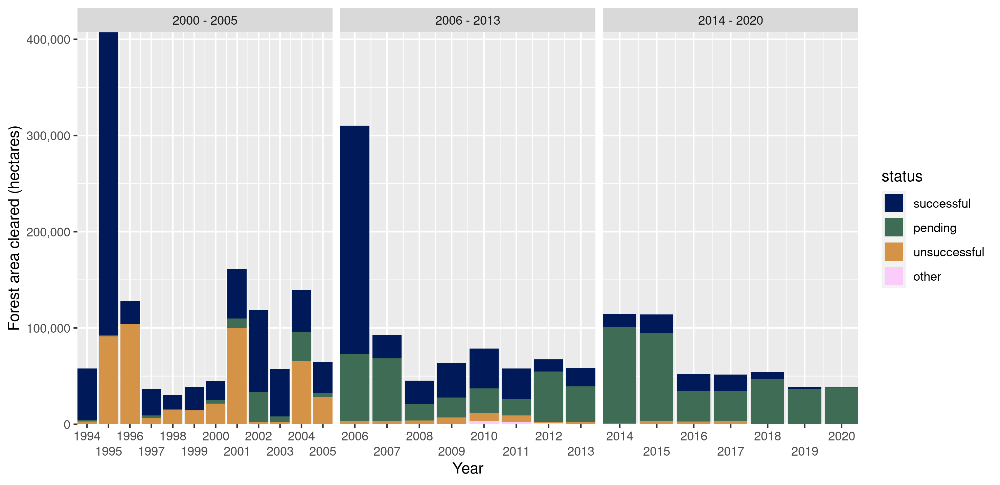

--- 
knit: "bookdown::render_book"
title: "India must strengthen its environmental governance regime"
author: Vijay Ramesh1*, Pratik Rajan Gupte2, Mridula Mary Paul3, Sarthak J Shetty4
date: "`r Sys.Date()`"
site: bookdown::bookdown_site
output: bookdown::gitbook
documentclass: book
# bibliography: [refs.bib]
biblio-style: apalike
link-citations: yes
github-repo: pratikunterwegs/forest-clearance-india
description: ""
---

# A Letter to the Editor of _Science_

With the stated intention of standardizing and rendering transparent the grant of environmental clearances, in March 2020, the Ministry of Environment, Forest and Climate Change (MoEFCC) of the Government of India, published a revised draft Environmental Impact Assessment (EIA) Notification, titled Draft EIA 2020 (1). Since the EIA process is crucial to balance environmental imperatives with economic development, environmentalists nationwide have voiced concerns with respect to this draft, citing considerable dilution of existing EIA regulations (2). 

The EIA Notification was initially issued in 1994 (3), and further revised by ministerial notification in 2006 (4). Analysis of MoEFCC forest clearance data (5) between 1994 and 2019 shows that projects applied for significantly more forest area to be cleared in years when or shortly after a new EIA notification was adopted. These years, 1995 and 2006, saw ~4,000 sq.km. and ~3,000 sq.km. proposed for clearance, which on average is nearly twice the area proposed in other years (6). Further, applications in 1995 and 2006 were just as successful as they were in other years, and thus 814% more forest area was approved for clearance compared to other years (6). 

Between 1994 and 2013, 70% of forest area proposed for clearances was approved. If this clearance rate were applied to forest areas pending under proposals since 2014, it could mean that an additional ~9,900 sq. km. of forest land would be cleared, about twice as much as in the preceding twenty years combined. Provisions in Draft EIA 2020 such as regularisation of violations of environmental safeguards, or allowing fencing off desired forest land before project approval will likely cause further forest loss and degradation. MoEFCC must reconsider Draft EIA 2020, and strengthen environmental governance if India is to meet national reforestation (7) and international climate targets (8).

**Affiliations**

1*Department of Ecology, Evolution and Environmental Biology, Columbia University, New York, NY 10027

2Groningen Institute for Evolutionary Life Sciences, University of Groningen, Groningen 9747 AG, The Netherlands

3Ashoka Trust for Research in Ecology and the Environment, Jakkur Post, Bengaluru 560064, India

4Department of Aerospace Engineering, Indian Institute of Science, Bengaluru, 560012, India

**References and notes:**

1. MoEFCC, “Draft Environmental Impact Assessment Notification” (New Delhi, 2020).
2. V. Chandrashekhar, India’s push to relax environmental assessment rules amid pandemic draws criticism. Science (80-. ). (2020), (available at https://www.sciencemag.org/news/2020/05/india-s-push-relax-environmental-assessment-rules-amid-pandemic-draws-criticism).
3. MoEFCC, “Environmental Impact Assessment Notification” (New Delhi, 1994).
4. MoEFCC, “Environmental Impact Assessment Notification” (New Delhi, 2006).
5. PARIVESH: A Single Window Integrated System for Environment, Forest, Wildlife and CRZ Clearances, (available at https://parivesh.nic.in/).
6. B. Borah, A. Bhattacharjee, N. Ishwar, “Bonn Challenge and India: Progress on restoration efforts across states and landscapes.” (New Delhi, 2018), (available at https://portals.iucn.org/library/sites/library/files/documents/2018-026-En.pdf).
7. M. Aggarwal, India needs to double rate of forest cover expansion to achieve Paris Agreement target. Mongabay India (2019), (available at https://india.mongabay.com/2019/11/paris-agreement-goals-india-needs-to-double-forest-cover-expansion-rate/).

8. Code and analyses are available on Zenodo: Pratik Rajan Gupte. (2020, July 1). pratikunterwegs/forest-clearance-india: Version_0.9_initial_release (Version v0.9). Zenodo. http://doi.org/10.5281/zenodo.3925793